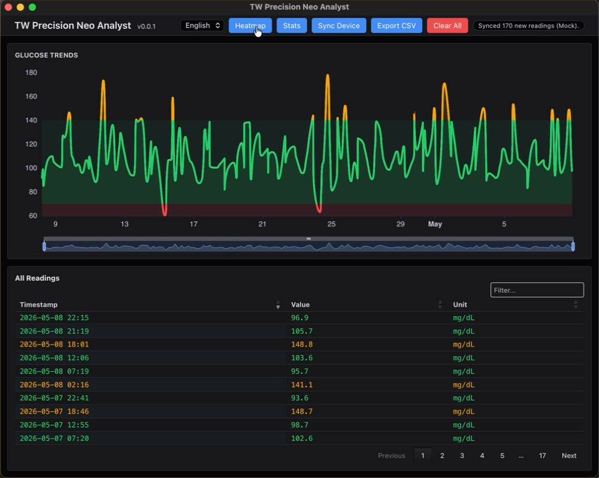
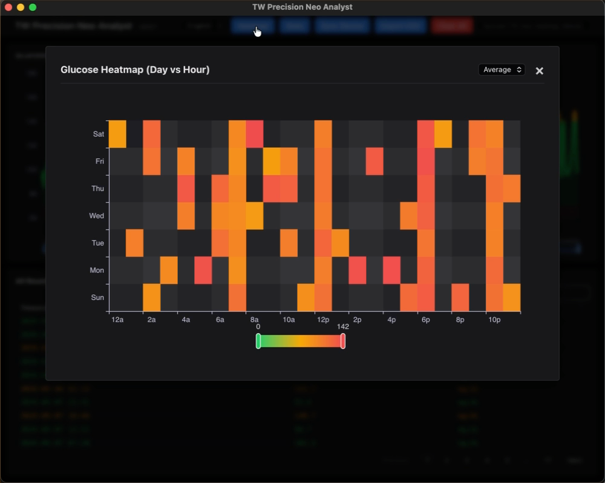
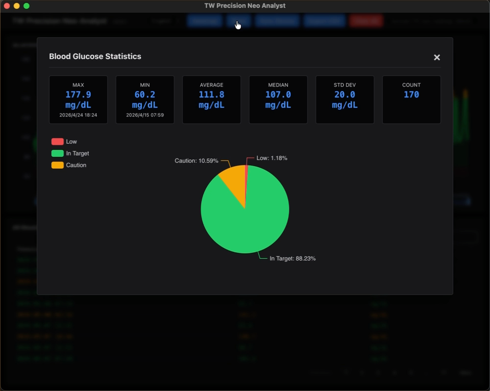

# tw-precision-neo
[](https://opensource.org/licenses/Apache-2.0)
[](https://www.python.org/)

**Modern data management app for FreeStyle Precision Neo / Optium Neo users.**

[日本語の README はこちら](./README_ja.md)

`tw-precision-neo` is an open-source desktop application developed for users who are frustrated that the official software (FreeStyle Auto-Assist) no longer runs on modern operating systems.

---

## 🌟 Key Features

- **Modern OS Support**: Fully compatible with Apple Silicon (M1/M2/M3) Mac and Windows 11.
- **Privacy First**: Blood glucose data is never sent to the cloud; it is stored only in a local database (SQLite) on your computer.
- **Auto Unit Conversion**: Supports both `mg/dL` (common in Japan/US) and `mmol/L` (common internationally).
- **Interactive Trend Charts**: Smooth, zoomable visualizations powered by ECharts.
- **Clinical Metrics**: Automatically calculates Time in Range (TIR) and other management indicators.
- **Trusted 'tw' Series**: A highly transparent project by the developer of the "TWSNMP" network management series.

## 📱 Supported Devices

- **Abbott FreeStyle Precision Neo**
- **Abbott FreeStyle Optium Neo**

## 📦 Installation

Download the latest version from the [GitHub Releases](https://github.com/twsnmp/tw-precision-neo/releases) page.

### macOS
Download and run the `.pkg` installer.
*Note: The app is Notarized by Apple and safe to run.*

### Windows
Download and run the `.msi` installer, or download the `.zip` file and extract it to a folder of your choice.

## 🚀 Usage

1.  **Connect**: Connect your Precision Neo to your PC using a standard Micro-USB cable.
2.  **Sync**: Launch the app and click the **"Sync Device"** button.
3.  **Analyze**: Instantly view your synced data and trend charts.

## 💾 Data Storage

All data is stored in a local SQLite database on your PC. Files are located at:

- **macOS**: `~/Library/Application Support/tw_precision_neo/tw_precision_neo.db`
- **Windows**: `%LOCALAPPDATA%\tw_precision_neo\tw_precision_neo.db`

## 📸 Demo & Screenshots

### Video Demo
<video src="images/tw-precision-neo-en.mp4" width="800" controls></video>

### Dashboard & Analytics
| Glucose Trends | Heatmap Analysis |
| :---: | :---: |
|  |  |

### Clinical Statistics


## ⚠️ Disclaimer

**This software is NOT a "Software as a Medical Device" (SaMD).**
It is intended for personal logging and informational purposes only. Do not use the information provided by this software for medical decisions, such as adjusting insulin doses. Always consult with your physician for medical guidance.

## 🛠 For Developers

This project is part of the **'tw' series** maintained by the developer of [TWSNMP](https://github.com/twsnmp).

### Development Environment Setup
Requires [mise](https://mise.jdx.dev/):
```bash
mise install
mise run setup
```

### Commands
- **Run in Dev Mode**: `mise run dev`
- **Run Tests**: `mise run test`
- **Build (Local Verification)**: `mise run build`

### Release & Packaging
- **macOS (Signed & Notarized)**:
  Signing is performed locally. If the `DEVELOPER_ID_APPLICATION` environment variable is set, it will be used.
  ```bash
  mise run release-mac
  ```
- **Windows**:
  Pushing to GitHub triggers **GitHub Actions**, which automatically builds the `.msi` installer.

## 📄 License

Distributed under the **Apache License 2.0**. See [LICENSE](LICENSE) for details.
