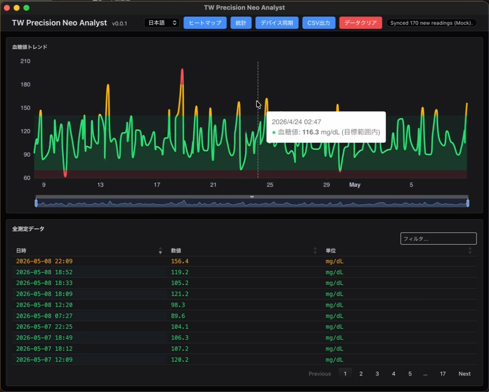
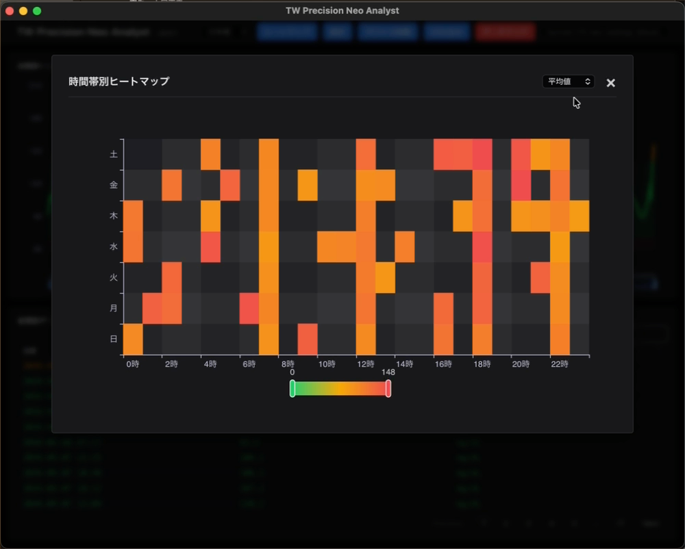
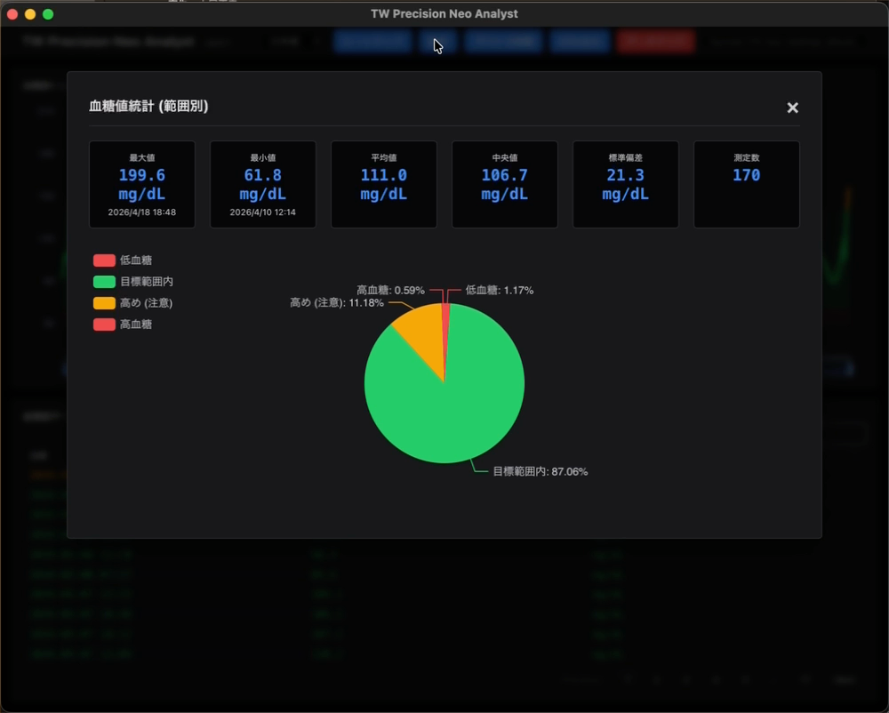

# tw-precision-neo
[](https://opensource.org/licenses/Apache-2.0)
[](https://www.python.org/)

**FreeStyle Precision Neo / Optium Neo ユーザーのための、現代的なデータ管理アプリ。**

[English README is here](./README.md)

`tw-precision-neo` は、公式ソフト（FreeStyle Auto-Assist）が最新のOSで動作しなくなったことに困っているユーザーのために開発された、オープンソースのデスクトップアプリです。

---

## 🌟 主な特徴

- **最新OS対応**: Apple Silicon (M1/M2/M3) Mac および Windows 11 に完全対応しています。
- **プライバシー重視**: 血糖データはクラウドには送信されず、あなたのPC内のローカルデータベース (SQLite) にのみ保存されます。
- **単位の自動変換**: 日本国内で一般的な `mg/dL` と、海外で使われる `mmol/L` の両方に対応。
- **インタラクティブな推移グラフ**: ECharts を使用した、スムーズでズーム可能なグラフ表示。
- **臨床指標の自動計算**: 目標範囲内時間 (TIR) を自動計算し、管理の質を可視化します。
- **信頼の 'tw' シリーズ**: ネットワーク管理ツール「TWSNMP」シリーズの開発者による、透明性の高いプロジェクトです。

## 📱 対応デバイス

- **Abbott FreeStyle Precision Neo** (日本国内で一般的)
- **Abbott FreeStyle Optium Neo** (海外で一般的)

## 🩸 血糖値の分類基準

本アプリでは、測定値を以下の基準で分類し、色分けして表示します：

| 分類 | mg/dL | mmol/L | 表示色 |
| :--- | :--- | :--- | :--- |
| **低血糖** | 70 未満 | 3.9 未満 | 赤 |
| **目標範囲内** | 70 - 140 | 3.9 - 7.8 | 緑 |
| **高め (注意)** | 141 - 180 | 7.9 - 10.0 | 黄 |
| **高血糖** | 181 - 250 | 10.1 - 13.9 | 赤 |
| **非常に高い** | 250 超 | 13.9 超 | 濃い赤 |

## 📦 インストール方法

最新バージョンを [GitHub Releases](https://github.com/twsnmp/tw-precision-neo/releases) ページからダウンロードしてください。

### macOS
`.pkg` インストーラーをダウンロードして実行してください。
*注意: アプリは Apple による公証(Notarized)を受けており、安全に実行できます。*

### Windows
`.msi` インストーラーをダウンロードして実行するか、`.zip` ファイルをダウンロードして任意のフォルダに解凍してください。

## 🚀 使い方

1.  **接続**: お手持ちの Precision Neo を標準の Micro-USB ケーブルで PC に接続します。デバイスの画面に **"PC"** と表示されていることを確認してください。
    
2.  **同期**: アプリを起動し、**「デバイス同期」**ボタンをクリックします。
3.  **分析**: 取得されたデータと推移グラフをすぐに確認できます。

## 💾 データの保存場所

すべてのデータは、お使い of PC 内のローカル SQLite データベースに保存されます。ファイルは以下の場所にあります：

- **macOS**: `~/Library/Application Support/tw_precision_neo/tw_precision_neo.db`
- **Windows**: `%LOCALAPPDATA%\tw_precision_neo\tw_precision_neo.db`

## 📸 デモ & スクリーンショット

### 動画デモ
<video src="images/tw-precision-neo-ja.mp4" width="800" controls></video>

### ダッシュボード & 分析
| 血糖値推移 | ヒートマップ分析 |
| :---: | :---: |
|  |  |

### 統計情報


## ⚠️ 免責事項

**本ソフトウェアは「プログラム医療機器（SaMD）」ではありません。**
個人のログ管理および情報参照のみを目的としています。本ソフトが提供する情報を、インスリン投与量の調整など治療に関する決定に使用しないでください。治療に関する決定は、必ず主治医の診断と指導に基づいて行ってください。

## 🛠 開発者向け

このプロジェクトは、[TWSNMP](https://github.com/twsnmp) の開発者によって維持されている **'tw'シリーズ**の一部です。

### 開発環境のセットアップ
[mise](https://mise.jdx.dev/) が必要です：
```bash
mise install
mise run setup
```

### 開発・ビルドコマンド
- **開発実行**: `mise run dev`
- **テスト実行**: `mise run test`
- **ビルド（ローカル確認用）**: `mise run build`

### リリース・パッケージング
- **macOS (署名・公証付き)**:
  セキュリティ保持のため、macOS版の署名は手元のMacで行います。
  環境変数 `DELELOPER_ID_APPLICATION` が設定されている場合はそれを使用し、未設定の場合は実行時に選択リストが表示されます。
  ```bash
  mise run release-mac
  ```
- **Windows**:
  GitHub にプッシュすると **GitHub Actions** が自動的にビルドを開始し、`.msi` インストーラーを生成します。

## 📄 ライセンス

**Apache License 2.0** の下で公開されています。詳細は [LICENSE](LICENSE) を参照してください。
